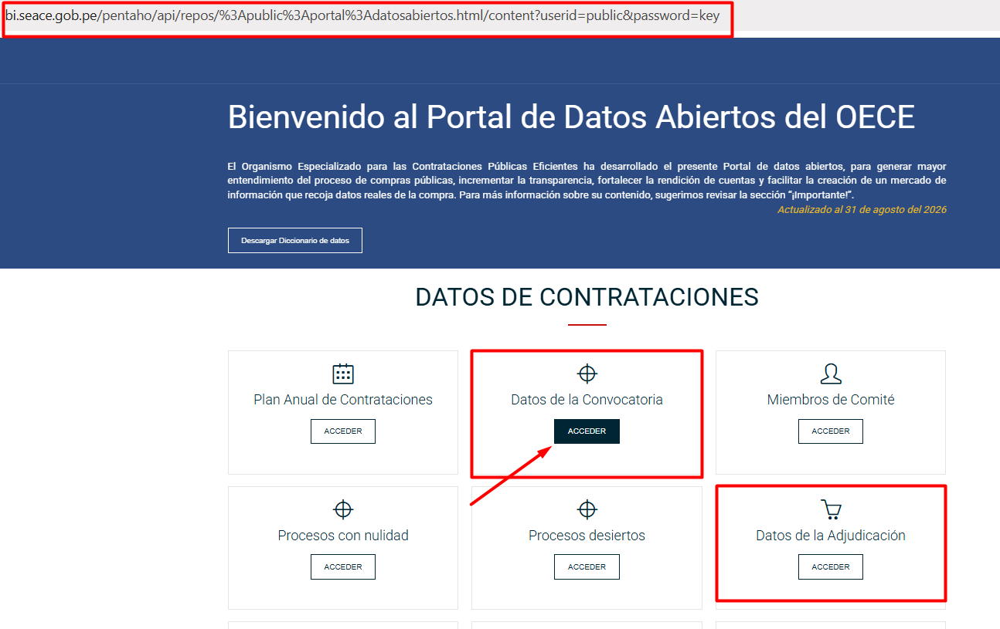
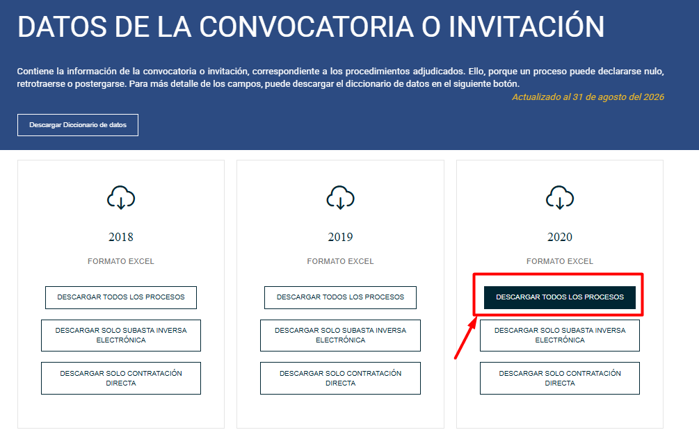
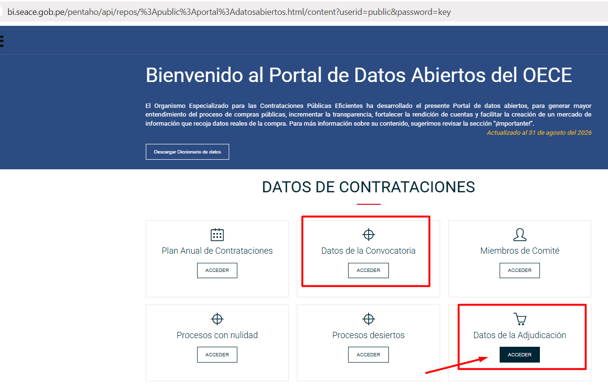
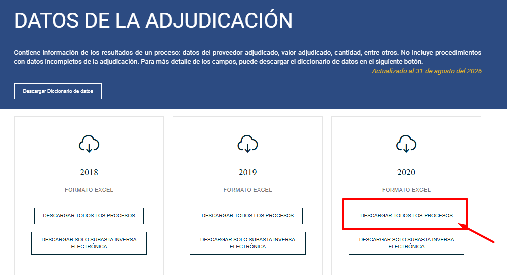

# Source Data

This directory contains the input data required to reproduce the sample-selection stage of the computational pipeline.

The source datasets are obtained from the **OECE-SEACE Open Data Portal (Peru)** and cover public procurement procedures from **2020 to 2025**.

> **Note:** Raw datasets are not stored in this repository. They must be downloaded from the official source before running the pipeline.

---

## Data Source

**Official source:** OECE-SEACE Open Data Portal  
**Dataset categories:** Procurement Notice Data and Contract Award Data  
**Study period:** 2020–2025  
**File format:** Microsoft Excel (`.xlsx`)  
**Total source datasets:** 12

The analysis requires two datasets for each year:

- **Procurement Notice Data** (`Datos de la Convocatoria`)
- **Contract Award Data** (`Datos de la Adjudicación`)

These datasets provide the procurement information required for sample construction, including procedure characteristics, contractual object, dates, reference amounts, and award information.

---

## Manual Data Acquisition

The 12 source datasets are downloaded manually from the OECE-SEACE Open Data Portal before executing the computational pipeline.

### 1. Procurement Notice Data

Access the OECE-SEACE Open Data Portal and select **“Datos de la Convocatoria”** (Procurement Notice Data).



For each year from **2020 to 2025**, select **“Descargar todos los procesos”** (Download All Procedures).



Download one Excel dataset for each year:

- 2020
- 2021
- 2022
- 2023
- 2024
- 2025

This produces **six Procurement Notice datasets**.

### 2. Contract Award Data

Return to the OECE-SEACE Open Data Portal and select **“Datos de la Adjudicación”** (Contract Award Data).



For each year from **2020 to 2025**, select **“Descargar todos los procesos”** (Download All Procedures).



Download one Excel dataset for each year:

- 2020
- 2021
- 2022
- 2023
- 2024
- 2025

This produces **six Contract Award datasets**.

The complete input therefore consists of **12 source Excel files**.

---

## Expected Source Files

The OECE-SEACE Open Data Portal provides the downloaded datasets using the following naming patterns:

```text
CONOSCE_CONVOCATORIAS2020_*.xlsx
CONOSCE_ADJUDICACIONES2020_*.xlsx

CONOSCE_CONVOCATORIAS2021_*.xlsx
CONOSCE_ADJUDICACIONES2021_*.xlsx

CONOSCE_CONVOCATORIAS2022_*.xlsx
CONOSCE_ADJUDICACIONES2022_*.xlsx

CONOSCE_CONVOCATORIAS2023_*.xlsx
CONOSCE_ADJUDICACIONES2023_*.xlsx

CONOSCE_CONVOCATORIAS2024_*.xlsx
CONOSCE_ADJUDICACIONES2024_*.xlsx

CONOSCE_CONVOCATORIAS2025_*.xlsx
CONOSCE_ADJUDICACIONES2025_*.xlsx
```

The final suffix may vary depending on the file generated by the portal.

Place the 12 downloaded Excel files directly inside `00_data/`.

The expected local structure is:

```text
00_data/
├── README.md
├── CONOSCE_CONVOCATORIAS2020_*.xlsx
├── CONOSCE_ADJUDICACIONES2020_*.xlsx
├── CONOSCE_CONVOCATORIAS2021_*.xlsx
├── CONOSCE_ADJUDICACIONES2021_*.xlsx
├── CONOSCE_CONVOCATORIAS2022_*.xlsx
├── CONOSCE_ADJUDICACIONES2022_*.xlsx
├── CONOSCE_CONVOCATORIAS2023_*.xlsx
├── CONOSCE_ADJUDICACIONES2023_*.xlsx
├── CONOSCE_CONVOCATORIAS2024_*.xlsx
├── CONOSCE_ADJUDICACIONES2024_*.xlsx
├── CONOSCE_CONVOCATORIAS2025_*.xlsx
└── CONOSCE_ADJUDICACIONES2025_*.xlsx
```

**No file renaming is required.**

---

## Reproducibility Requirements

The sample-selection script automatically identifies the corresponding Procurement Notice and Contract Award datasets for each year from **2020 to 2025**.

For each year, `00_data/` must contain:

- exactly **one** `CONOSCE_CONVOCATORIAS{year}_*.xlsx` file; and
- exactly **one** `CONOSCE_ADJUDICACIONES{year}_*.xlsx` file.

The raw Excel datasets are excluded from version control because they are obtained separately from the official OECE-SEACE source.

Once all 12 source datasets are available in `00_data/`, execute the sample-selection script from the repository root:

```bash
python 01_scripts/00_filtro_muestra.py
```

The generated outputs are written to:

```text
02_results/
```

---

## Data Flow

The source-data stage of the pipeline follows this sequence:

```text
OECE-SEACE Open Data Portal
            │
            ▼
 Procurement Notice Data
       (2020–2025)
            │
            ├──────────────┐
            │              │
            ▼              ▼
     6 Excel files   Contract Award Data
                         (2020–2025)
                              │
                              ▼
                        6 Excel files
                              │
              ┌───────────────┘
              ▼
        12 source datasets
              │
              ▼
           00_data/
              │
              ▼
  01_scripts/00_filtro_muestra.py
              │
              ▼
          02_results/
```

---

## Data Provenance

All raw procurement data used in this stage originate from the official **OECE-SEACE Open Data Portal**.

The 12 Excel datasets covering **2020–2025** constitute the primary data inputs for the sample-selection stage and the subsequent computational pipeline.

The repository does not distribute copies of these raw datasets. Instead, it documents their provenance, acquisition procedure, expected naming convention, and location within the reproducible project structure.
