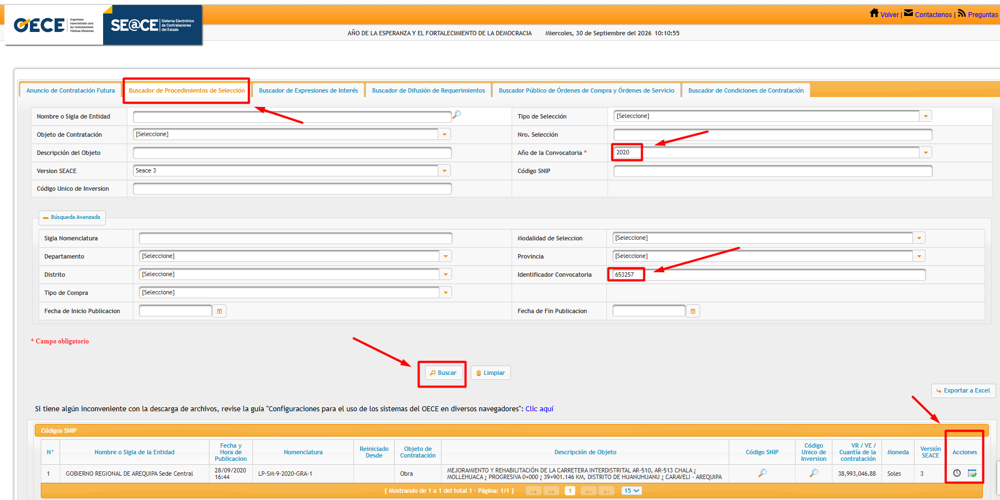
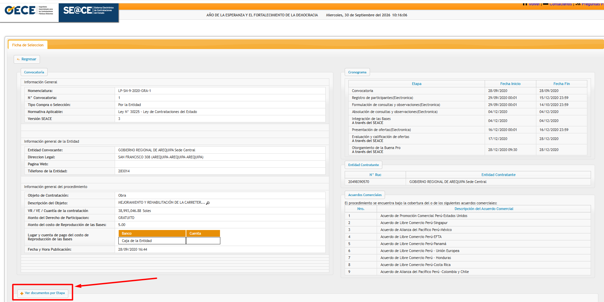
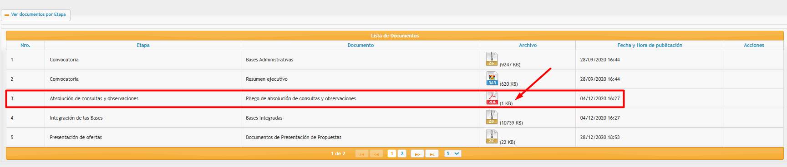
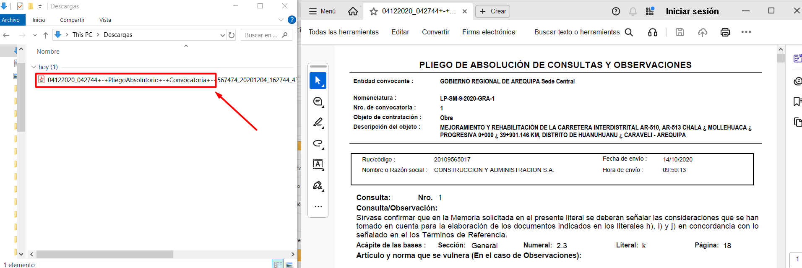

# Simulación estocástica del efecto de la asimetría de información en la incertidumbre de los plazos de adjudicación en licitaciones de infraestructura vial peruana

**Autor:** Br. Alan Bruce Hurtado Zavaleta  
**Asesor:** Mg. Arq. José Franklin Gonzales Culqui  
**Universidad:** Universidad Nacional Toribio Rodríguez de Mendoza de Amazonas (UNTRM)  
**Año:** 2026  

---

## Descripción

Este repositorio contiene el código fuente, los resultados y la evidencia de ejecución del pipeline computacional desarrollado para la tesis:

> **“Simulación estocástica del efecto de la asimetría de información en la incertidumbre de los plazos de adjudicación en licitaciones de infraestructura vial peruana”.**

El pipeline procesa información proveniente de los Datos Abiertos del OECE-SEACE correspondiente al periodo **2020-2025** y automatiza las principales etapas de construcción y procesamiento de la base de investigación.

El procedimiento permite:

1. Filtrar el universo de procedimientos de selección y construir una muestra censal de **137 procesos de licitación pública de infraestructura vial**.
2. Localizar y descargar automáticamente la documentación asociada a los procedimientos desde el SEACE.
3. Identificar y contabilizar las consultas y observaciones formuladas durante la etapa correspondiente del procedimiento.
4. Integrar los conteos obtenidos con la base principal de investigación.
5. Clasificar los procedimientos en escenarios de **baja, media y alta asimetría informativa**.
6. Preparar la información necesaria para el análisis estadístico y la posterior simulación estocástica de los plazos de adjudicación.

El propósito de la investigación es analizar el efecto de la asimetría de información sobre la incertidumbre de los plazos de adjudicación y generar evidencia que contribuya a la planificación precontractual de proyectos de infraestructura vial.

---

## Estructura del repositorio

```text
.
├── 01_scripts/
│   ├── 00_filtro_muestra.py
│   ├── 01_descargar_pdfs.py
│   ├── 02_contar_consultas.py
│   ├── 03_integrar_resultados.py
│   └── 04_calcular_escenarios.py
│
├── 02_results/
│   └── BASE_FINAL_CON_CONTEOS.xlsx
│
├── 03_logs/
│   └── log_descarga_masiva_v7.txt
│
├── 04_screenshots/
│   ├── 01_captura_busqueda_seace.png
│   ├── 02_captura_ficha_proceso.png
│   ├── 03_captura_documentos_etapa.png
│   └── 04_captura_pliego_absolucion.png
│
├── README.md
├── LICENSE
└── .gitignore
```

---

## Pipeline computacional

El procesamiento de los datos se organiza en cinco scripts principales que deben ejecutarse secuencialmente.

| Script | Función | Entrada | Salida |
|---|---|---|---|
| `00_filtro_muestra.py` | Filtrado del universo de procedimientos | 12 archivos XLSX (2020-2025) | `BASE_FINAL_137_PROCESOS.xlsx` |
| `01_descargar_pdfs.py` | Descarga automatizada de documentos del SEACE | `BASE_FINAL_137_PROCESOS.xlsx` | PDFs almacenados localmente |
| `02_contar_consultas.py` | Extracción y conteo de consultas y observaciones | PDFs descargados | `conteos_consultas.xlsx` |
| `03_integrar_resultados.py` | Integración de los conteos con la base principal | Base + conteos | `BASE_FINAL_CON_CONTEOS.xlsx` |
| `04_calcular_escenarios.py` | Clasificación según nivel de asimetría informativa | `BASE_FINAL_CON_CONTEOS.xlsx` | Tablas y resultados por escenario |

### Flujo general

```text
Datos Abiertos OECE-SEACE
      2020-2025
          │
          ▼
┌──────────────────────────────┐
│ Script 00                    │
│ Filtrado del universo        │
└──────────────┬───────────────┘
               │
               ▼
  BASE_FINAL_137_PROCESOS.xlsx
               │
               ▼
┌──────────────────────────────┐
│ Script 01                    │
│ Descarga de documentos       │
│ desde el SEACE               │
└──────────────┬───────────────┘
               │
               ▼
       Documentos PDF
               │
               ▼
┌──────────────────────────────┐
│ Script 02                    │
│ Conteo de consultas y        │
│ observaciones                │
└──────────────┬───────────────┘
               │
               ▼
      conteos_consultas.xlsx
               │
               ▼
┌──────────────────────────────┐
│ Script 03                    │
│ Integración de resultados    │
└──────────────┬───────────────┘
               │
               ▼
 BASE_FINAL_CON_CONTEOS.xlsx
               │
               ▼
┌──────────────────────────────┐
│ Script 04                    │
│ Clasificación en escenarios  │
│ de asimetría informativa     │
└──────────────┬───────────────┘
               │
               ▼
      Resultados finales
```

---

## Requisitos

El pipeline fue desarrollado en **Python**.

### Versión recomendada

- Python 3.11.7 o superior

### Principales librerías

- `pandas`
- `numpy`
- `playwright`
- `pymupdf`
- `google-genai`
- `openpyxl`

### Instalación

Ejecutar:

```bash
pip install pandas numpy playwright pymupdf google-genai openpyxl
```

Posteriormente instalar Chromium para Playwright:

```bash
playwright install chromium
```

---

## Uso

Los scripts deben ejecutarse de manera secuencial debido a que la salida de una etapa constituye la entrada de la siguiente.

### 1. Filtrado de la muestra

```bash
python 01_scripts/00_filtro_muestra.py
```

### 2. Descarga de documentos del SEACE

```bash
python 01_scripts/01_descargar_pdfs.py
```

### 3. Conteo de consultas y observaciones

```bash
python 01_scripts/02_contar_consultas.py
```

### 4. Integración de resultados

```bash
python 01_scripts/03_integrar_resultados.py
```

### 5. Clasificación en escenarios

```bash
python 01_scripts/04_calcular_escenarios.py
```

---

## Metodología para el conteo de consultas y observaciones

El Script 02 (`02_contar_consultas.py`) implementa un procedimiento de extracción y conteo de las consultas y observaciones contenidas en los documentos obtenidos del SEACE.

El procesamiento local mediante **PyMuPDF** constituye el mecanismo principal para la lectura y análisis de los documentos PDF.

En aquellos documentos cuya estructura, digitalización o contenido dificulta la determinación automática del número de consultas y observaciones, el pipeline puede utilizar **Gemini como mecanismo complementario de respaldo**.

Este enfoque permite tratar documentos con diferentes estructuras y niveles de legibilidad manteniendo un procedimiento automatizado y reproducible.

---

## Configuración de la API Key de Gemini

Para utilizar el mecanismo de respaldo basado en Gemini, cada usuario debe configurar su propia API Key.

La clave puede obtenerse desde Google AI Studio:

https://aistudio.google.com/app/apikey

En el Script 02 debe localizarse la configuración correspondiente:

```python
API_KEY = "TU_API_KEY_DE_GEMINI"
```

y reemplazarla por la clave personal:

```python
API_KEY = "su_clave_personal_aqui"
```

> **Importante:** Una API Key real nunca debe almacenarse públicamente en GitHub ni incorporarse a un repositorio público.

El procesamiento principal mediante PyMuPDF no requiere una API Key. Gemini se utiliza únicamente como mecanismo complementario para documentos que requieren un tratamiento adicional.

---

## Resultados principales

La aplicación del pipeline permitió obtener una muestra final de:

**137 procesos de licitación pública de infraestructura vial correspondientes al periodo 2020-2025.**

Para la clasificación del nivel de asimetría informativa se utilizaron los percentiles de la distribución del número de consultas y observaciones:

- **P25 = 23**
- **P75 = 134**

A partir de estos puntos de corte se definieron tres escenarios:

| Escenario | N | Porcentaje | Media de consultas | Media del plazo (días) | Desv. estándar del plazo (días) |
|---|---:|---:|---:|---:|---:|
| Baja asimetría | 36 | 26.3 % | 11.17 | 62.14 | 40.19 |
| Media asimetría | 67 | 48.9 % | 66.25 | 105.64 | 76.96 |
| Alta asimetría | 34 | 24.8 % | 220.97 | 156.58 | 86.72 |
| **Total** | **137** | **100.0 %** | — | — | — |

### Criterios de clasificación

Los escenarios de asimetría informativa se establecen a partir de los percentiles P25 y P75:

- **Baja asimetría:** procedimientos ubicados en el tramo inferior de la distribución.
- **Media asimetría:** procedimientos comprendidos entre los puntos de corte establecidos.
- **Alta asimetría:** procedimientos ubicados en el tramo superior de la distribución.

La variable utilizada como indicador observable de asimetría informativa corresponde al **número de consultas y observaciones registradas en el procedimiento de selección**.

---

## Evidencia de ejecución

Con el propósito de garantizar la trazabilidad y reproducibilidad del procesamiento, el repositorio incluye evidencia de las diferentes etapas de ejecución.

### Log de descarga

```text
03_logs/log_descarga_masiva_v7.txt
```

Este archivo registra información generada durante el proceso automatizado de descarga de documentos.

### Base de datos final

```text
02_results/BASE_FINAL_CON_CONTEOS.xlsx
```

Contiene la base consolidada utilizada para el análisis posterior de los 137 procedimientos seleccionados.

### Capturas del SEACE

La carpeta:

```text
04_screenshots/
```

contiene evidencia visual del procedimiento utilizado para localizar y acceder a la documentación en el SEACE.

Las capturas incluidas son:

| Archivo | Evidencia |
|---|---|
| `01_captura_busqueda_seace.png` | Búsqueda del procedimiento en el SEACE |
| `02_captura_ficha_proceso.png` | Acceso a la ficha del procedimiento de selección |
| `03_captura_documentos_etapa.png` | Visualización de los documentos correspondientes a la etapa |
| `04_captura_pliego_absolucion.png` | Identificación del documento de consultas y observaciones |

### Visualización de las capturas

#### 1. Búsqueda del procedimiento en el SEACE



#### 2. Ficha del procedimiento de selección



#### 3. Documentos de la etapa



#### 4. Pliego de consultas y observaciones



---

## Reproducibilidad y trazabilidad

La estructura del repositorio permite mantener separadas las principales etapas del procesamiento:

- **Código fuente:** `01_scripts/`
- **Resultados:** `02_results/`
- **Registros de ejecución:** `03_logs/`
- **Evidencia visual:** `04_screenshots/`

Esta organización permite rastrear el procesamiento desde los datos originales hasta la generación de la base consolidada y los escenarios de asimetría informativa.

Los scripts están numerados de acuerdo con su orden de ejecución para facilitar la reproducción del procedimiento computacional.

---

## Fuente de datos

Los datos utilizados corresponden a procedimientos de contratación pública registrados en el **OECE-SEACE**, para el periodo de estudio **2020-2025**.

El repositorio contiene los scripts utilizados para el procesamiento de la información y los resultados derivados necesarios para garantizar la trazabilidad metodológica de la investigación.

---

## Licencia

Este proyecto está bajo la **Licencia MIT**. Consulte el archivo `LICENSE` para más detalles.

---

## Contacto

**Autor:** Alan Bruce Hurtado Zavaleta  
**Correo:** 4571604421@untrm.edu.pe  
**GitHub:** [@AlanBruce10](https://github.com/AlanBruce10)

---

## Citación

Si utiliza este código o los resultados derivados del pipeline con fines académicos, se recomienda citar la investigación asociada:

**Hurtado Zavaleta, A. B. (2026).** *Simulación estocástica del efecto de la asimetría de información en la incertidumbre de los plazos de adjudicación en licitaciones de infraestructura vial peruana*. Universidad Nacional Toribio Rodríguez de Mendoza de Amazonas.
